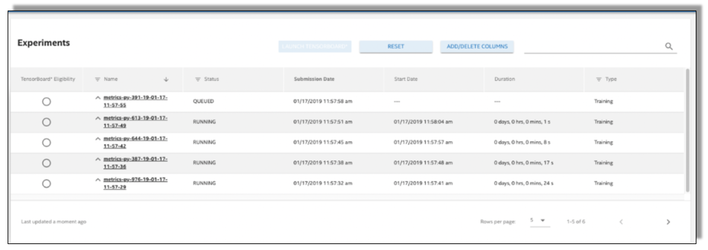

# User Management 

As an Administrator there are certain tasks you need to perform, such as creating and deleting user accounts, as well as understanding the limitations around these tasks. 

This section discusses the following main topics: 

- [User Account Creation](#user-account-creation)  
- [Delete a User Account](#delete-a-user-account)
- [Purging Process](#purging-process)
- [Launching the Web UI](#launching-the-web-ui)

## User Account Creation

When you create a new user account, it creates a _user account configuration file_ with _kubectl configuration_ files. 

### Setting up an Administrator Environment

Before creating user accounts, you _must_ complete the following steps:

1. Install nctl using the description in the [Nauta User Guide](/docs/user-guide).
   
2. Copy the `nauta-admin.config` file to the machine where nctl resides.  

- An Administrator will need the `nauta-admin.config` file on their machine (the machine where nctl resides) and it needs to be set in the `kube.config` file.

3. Set up `KUBECONFIG` variable to point to the full path of the `nauta-admin.config` to where you copied the file in step number 2. 

4. Follow the instructions below (_Creating a User Account_) to create users.

   `export KUBECONFIG=<PATH>/nauta-admin.config`

## Creating a User Account

The following steps are used to create a Nauta user account, not a Nauta Administrator account. Only a Nauta Administrator account has permissions to create user accounts. The Nauta Administrator account file is created as a result of the Nauta installation and should be obtained from the person that completed the installation.

### Administrator Tasks

1. The Nauta `user create` command sets up a namespace and associated roles for the named user on the cluster. It sets up home directories, named after the username, on the input and output network shares with file-system level access privileges. To create a user, execute the following command:
 
   `nctl user create <username>`

2. This command also creates a configuration file named `<username>.config` and places this file in the user's home directory. To verify that your new user has been created, execute the following command:

   `nctl user list`

3. This lists all users, including the new user just added, but _does not_ show Administrators. An example is shown below. (scroll right to see the full contents). 

```
| Name    | Creation date          | Date of last submitted job   |   Number of running jobs |   Number of queued jobs|
|---------+------------------------+------------------------------+--------------------------+-------------------------
| user1   | 2019-03-12 08:30:45 PM | 2019-02-27 07:55:13 PM       |                        1 |                       1|
| user2   | 2019-03-12 09:50:50 PM |                              |                        0 |                       0|
| user3   | 2019-03-12 09:51:31 PM |                              |                        0 |                       0|

```

The above command lists all users, including any new user just added.

### User Tasks

1. As an Administrator, you need to provide the `<username>.config` file to the Nauta user. The user _must save_ this file to an appropriate location of their choosing on the machine that is running Nauta. For example, their `home directory` using the following command:
   
   `cp <username>.config ~/`

2. Use the export command to set this variable for the user:

   `export KUBECONFIG=~/<username>.config`

### Limitations

Users with the same name _cannot_ be created directly after being removed. In addition, user names are limited to a 32-character maximum, and there are no special characters except for hyphens. However, all names _must_ start with a letter _not_ a number. You can use a hyphen to join user names, for example: john-doe (refer to [Troubleshooting](../Troubleshooting/T.md) for more details). 


## Delete a User Account

Only an Administrator can delete user accounts and deleting a user removes that user's account from the Nauta software; therefore, that user _will not_ be able to log in to the system. This will halt and remove all experiments and pods. However, all artifacts related to that user's account, such as the users input and output folders and all data related to past experiments they have submitted remains. 

### Remove a User

To remove a user, execute the following command:

 `nctl user delete <user_name>`

Respond to this question to confirm the previous step. 

`Do you want to continue? [y/N]: press y to confirm deletion.`

The command may take up to 30 seconds to delete the user and you may receive the message: _User is still being deleted_. Check the status of the user after a few minutes. Recheck as desired.

## Purging Process 

To permanently remove (_Purge_) all artifacts associated with the user and all data related to past experiments submitted by that user (but, _**excluding**_ the contents of the user’s input and output folders) execute the following command: 

`nctl user delete <user_name> -p/--purge`

Respond to this question to confirm the previous step. 

`Do you want to continue? [y/N]: press y to confirm deletion.`
      
### Limitations	

The Nauta `user delete` command may take up to 30 seconds to delete the user. A new user with the same username _cannot_ be created until after the delete command confirms that the first user with the same name has been deleted (refer to [Troubleshooting](../Troubleshooting/T.md) for more details).

## Launching the Web UI 

To review the Resources Dashboard, launch the Web UI from the Command Line Interface (CLI). refer to the [Nauta User Guide](../user-guide/) for more information.  

Do the following to launch the Web UI:

1. Execute the following command:

   `nctl launch webui` 
    
2. Your default Web browser opens and displays the Web UI. For Administrators, the Web UI displays a list experiments and shows the following message:

   `No data for currently signed user. Click here to load all users data.`

The image shows the Nauta Web UI. This UI contains experiment information that can be sorted by name, status, and various dates. Refer to the [Nauta User Guide](/docs/user-guide) for detailed Nauta Web UI information.  




## Next Steps: Troubleshooting Information

* [Troubleshooting Information](../Troubleshooting/T.md)

----------------------

## Return to Start of Document

* [README](../README.md)

----------------------

