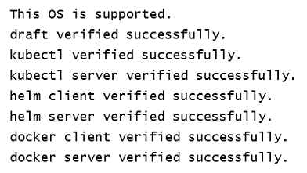
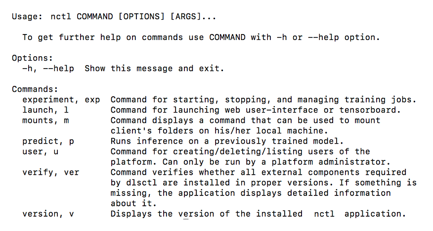
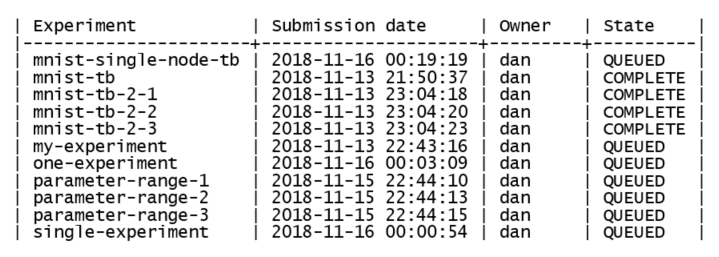
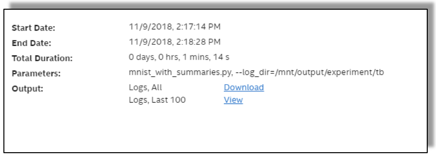

# Getting Started

This section provides brief examples for performing some of the most essential and valuable 
tasks supported by Nauta. 

**Note:** Several commands and training scripts in this section require access to the internet to download data, scripts, etc.

The section discusses the following main topics:

 - [ Verifying Installation](#verifying-installation)
 - [Overview of nctl Commands](#overview-of-nctl-commands)
 - [Example Experiments](#example-experiments)
 - [Adding Experiment Metrics: Optional](#adding-experiment-metrics-optional)
 - [Viewing Experiment Results from the Web UI](#viewing-experiment-results-from-the-web-ui)
 - [Launching Kubernetes Dashboard](#launching-kubernetes-dashboard)
 - [Launching TensorBoard](#launching-tensorboard)
 - [Inference](#inference)
 - [Overview of nctl Commands](#overview-of-nctl-commands)
 - [Viewing Experiment Output Folder](#viewing-experiment-output-folder)
 - [Removing Experiments: Optional](#removing-experiments-optional)

## Verifying Installation

Check that the required software packages are available in terminal by PATH and verified that correct version is used.

### Docker Settings

Docker* can contain kubectl* binary in a version that _is not_ supported. Therefore, verify that the PATH environment variable has the correct order of paths and that the kubectl from docker package _is not_ used.

### Proxy Envoriment Variables 

If you are behind a proxy, remember to set your:

* http_proxy, https_proxy and no_proxy environment variables
* HTTP_PROXY, HTTPS_PROXY and NO_PROXY environment variables

### Confirm Installation

To verify your installation has completed, execute the following command: 
`nctl verify`

### Confirmation Message

If any installation issues are found, the command returns information about the cause: which application should be installed and in which version. This command also checks if the CLI can connect to Nauta; and, if port forwarding to Nauta is working correctly. If no issues are found, a message indicates checks were successful. The following examples are the results of this command

If any installation issues are found, the command returns information about the cause: which application should be installed and in which version. This command also checks if the CLI can connect to Nauta; and, if port forwarding to Nauta is working correctly. If no issues are found, a message indicates checks were successful. The following examples are the results of this command:
 


## Overview of nctl Commands

Each `nctl` command has at least two options:

* `-v, --verbose` - Set verbosity level:
  * `-v` for INFO - Basic logs on INFO/EXCEPTION/ERROR levels are displayed.
  * `-vv` for DEBUG - Detailed logs on INFO/DEBUG/EXCEPTION/ERROR levels are displayed.
* `-h, --help` - The application displays the usage and options available for a specific command or subcommand.
 
Access help for any command with the `--help` or `-h` parameter. The following command provides a list and brief description of all nctl commands. 

`nctl --help`

The results are shown below.

 


## Example Experiments

The Nauta installation includes sample training scripts and utility scripts, contained in the `examples` folder, that can be run to demonstrate how to use Nauta. This section describes how to use these scripts. 

### Examples Folder Content

The examples folder in the nctl installation contains these following experiment scripts:

* `mnist_single_node.py` - Training of digit classifier in single node setting
* `mnist_multinode.py` - Training of digit classifier in distributed TensorFlow setting
* `mnist_horovod.py` - Training of digit classifier in Horovod

### Utility Scripts

There are two utility scripts, these are:

`mnist_converter_pb.py` 

`mnist_checker.py`

These are used for inference process and model verification.

**Note**: Experiment scripts _must be_ written in Python.  

### Launch Training Using the Scripts

Launching training in Nauta is performed with the following command:

**Syntax**: `nctl experiment submit -t template SCRIPT_LOCATION`

with:
* `template` = `tf-training-tfjob` and `SCRIPT_LOCATION` = `examples/mnist_single_node.py` (relative to nctl
root) for single node training. The template parameter in this case is optional.
* or `template` = `multinode-tf-training-tfjob` and `SCRIPT_LOCATION` = `examples/mnist_multinode.py` for multinode
training,
* or `template` = `multinode-tf-training-horovod` and `SCRIPT_LOCATION` = `examples/mnist_horovod.py` for Horovod
training.

**Note**: All the examples shown assumes that macOS is utilized.

### Submitting an Experiment
  
The included example scripts do not require an external data source. The scripts automatically download the MNIST dataset. Templates referenced here have set CPU and Memory requirements. To change template-related requirements (if desired), refer to the template packs documentation.

**Note:** For experiment submit command information, refer to [experiment Command](experiment.md) for more details.

The following example shows how to submit a MNIST experiment and write the TensorBoard data to a folder in your Nauta output folder.

Enter the following command to run this example:

`$ nctl experiment submit -t tf-training-tfjob examples/mnist_single_node.py --name single`

**Syntax**:

The following is the basic syntax for experiment submit command:

`nctl experiment submit [options] SCRIPT_LOCATION -- [script_parameters]`

**Where**:
* `-t`,  TEXT: Name of a template that will be used by Nauta to create a description of a job to be submitted. By default, this is a single-node tensorflow training. The template is chosen. The list of available templates can be obtained by issuing the `nctl experiment template_list` command.
* `SCRIPT_LOCATION`: The path and name of the Python script use to perform this experiment.

**Note**: To run TensorBoard, TensorBoard data _must be_ written to a folder in the directory `/mnt/output/experiment`. This example script takes care of this requirement; however, your scriptswill need to meet the same requirements.

#### Result of this Command

The execution of the submit command may take a few minutes the first time. During this time, resources are allocated, the experiment package is created using parameters, scripts, and settings, a docker image is built then pushed to the Kubernetes cluster. When the experiment submission is complete, the following result is displayed:

  

#### Viewing Experiment Status

Use the following command to view the status of all your experiments:

**Syntax**: `nctl experiment list [options]`

Enter this commmand: 

`$ nctl experiment list --brief`

Experiment status displays as below.  This is an example only. The `--brief` option returns a short version of results as shown.

  
 
### Monitoring Training

 There are four ways to monitor training in Nauta, all which are discussed in the following sections. 
 
* Viewing Experiment Logs
* Adding Experiment Metrics
* Viewing Experiment Results from the Web UI
* Launching TensorBoard

### Viewing Experiment Logs 

Use the following command to view the experiment log.

**Syntax**: `nctl experiment logs [options] EXPERIMENT_NAME`

Enter this command:

`$ nctl experiment logs mnist-tb`

A log displays as follows. The result below is an example only.

   

## Adding Experiment Metrics: Optional

Experiments launched in Nauta can output additional kinds of metrics using the publish function from the experiment metrics API. To see an example of metrics published with the single experiment executed in the above example, enter this command:

`$ nctl experiment list`

As shown in the example, only a fragment result is shown:

 

To add metrics to an experiment file you have created, you need to edit the experiment file to use the `experiment_metrics.api` and then publish the accuracy in your experiment file. Perform the following steps: 

1. Add the metrics library API with the following entry in your experiment file:
   `from experiment_metrics.api import publish`

2.	Add metrics for publishing the last step's accuracy by adding this code in the ‘def feed_dict’ definition after the for loops: 
   ```
   metrics = {}
   metrics["accuracy_step_{}".format(i)] = str(acc)
   publish(metrics)
   ```
3.	Save the changes.

4.	Submit the experiment again, but with a different name. 
      
5.	The published metrics can now be viewed. 

    `$ nctl experiment list`

**Saving Metrics for Multinode Experiments**

Storing at the same time two (or more) metrics with the same key from two different nodes may lead to errors (such as loosing some logs) due to conflicting names. To avoid this, adding metrics for multinode experiments should be done using one of the two following methods:

### Method 1

The key of a certain metric should also contain a node identificator from which this metric comes. Creation of such identificator can be done in the following ways:

* For `horovod` multinode training jobs, result of the rank() function provided by the Horovod package can be used as a node's identificator.  
    
* For `tfjob multinode training` jobs, a user can utilize all necessary information from the `TF_CONFIG` environment variable. A code example for creating an identificator is shown below.

    ```
    tf_config = os.environ.get('TF_CONFIG')
    if not tf_config:
        raise RuntimeError('TF_CONFIG not set!')

    tf_config_json = json.loads(tf_config)

    job_name = tf_config_json.get('task', {}).get('type')
    task_index = tf_config_json.get('task', {}).get('index')
    # final node identificator `node_id = '-'.join(job_name,task_index)`
    ```

### Method 2

Only one node should store metrics. Deciding which node should store metrics can be done in the following ways:  

* For `horovod` multinode training jobs, the horovod python library provides the `rank()` function that returns a number
of a current worker. _Master_ is marked with the number 0, so only a pod with this number should store logs.

* For `tfjob` multinode training jobs, as there is _no_ dedicated master node. Therefore, a user should choose which worker should be responsible for storing metrics. The identificator of a current worker can be obtained, as described in _[Method 1](#Method-1)_. Furthermore, a user should choose an identificator and store the logs, but only from a node that has this chosen ID. 
   
## Viewing Experiment Results from the Web UI

The web UI lets you explore the experiments you have submitted. To view your experiments at the web UI, enter the following command at the command prompt:

`$ nctl launch webui`

**Note**: If you are using CLI through remote access, you will need to setup a X server for tunneling over SSH with port forwarding or use SSH Proxy command tunneling.  After establishing a tunnel from the gateway to your local machine, you can use the URL by this command.

An example is shown in the screen below.

 

* **Name:** The left-most column lists the experiments by name.
* **Status:** This column reveals experiment’s current status, one of: `QUEUED, RUNNING, COMPLETE, CANCELLED, FAILED, CREATING`.
* **Submission Date**: This column gives the submission date in the format: MM/DD/YYYY, hour:min:second AM/PM.
* **Start Date:** This column shows the experiment start date in the format: MM/DD/YYYY, hour:min:second AM/PM.
* **Duration:** This column shows the duration of execution for this experiment in days, hours, minutes and seconds.
* **Type:** Experiment Type can be Training, Jupyter, or Inference. Training indicates that the experiment was launched from the CLI. Jupyter indicates that the experiment was launched using Jupyter Notebook. Inference means that training is largely complete and you have begun running predictions (inference) with this model.

You can perform the tasks discussed below at the web UI.

### Expand Experiment Details

Click _listed experiment name_ to see additional details for that experiment. The following details are examples only. 
This screen is divided into two frames: left-side and right-side frames. 

### Left-most Frame

The left-side frame of the experiment shows the resources and submission date and time (as shown in the figure below).

* **Resources** Assigned to that experiment, specifically the assigned pods and their status and container information including the CPU and memory resources assigned.
* The **Submission Date** and time.


 
### Right-side Frame
 
The right-side frame of the experiment details windows shows (as shown in the figure below).

* **Start Date:** The day and time this experiment was launched. 
* **End date:** The day and time this experiment was launched. 
*	**Total Duration:** The actual duration this experiment was instantiated.
*	**Parameters:** The experiment script file name and the log directory.
* **Output:** Clickable links to download all logs and view the last 100 log entries. 
 


### Searching on Experiments

In the **Search** field at the far right of the UI , enter a string of alphanumeric characters to match the 
experiment name or other parameters (such as user), and list only those matching experiments. This Search function lets the user search fields in the entire list, not just the experiment name or parameters. 

### Adding/Deleting Columns

Click **ADD/DELETE COLUMNS** to open a dialogue. Here, the columns currently in use are listed first with 
their check box checked. Scroll down to see more, available columns listed next, unchecked. 

Click to check and uncheck and select the column headings you prefer. Optional column headings include parameters such as Pods, End Date, Owner, Template, Time in Queue, etc.

Column headings also include metrics that have been setup using the Metrics API, for a given experiment, and you 
can select to show those metrics in this display as well. Column additions and deletions you make are retained between logins.

Refer to [Launching TensorBoard to View Experiments](view_exp_tensorbd.png) for more information..

## Launching Kubernetes Dashboard

Click the hamburger menu  at the far left of the UI to open a left frame. Click **Resources Dashboard** to open the Kubernetes resources dashboard. Refer to [Accessing the Kubernetes Resource Dashboard](accessing_kubernetes.md).

## Launching TensorBoard

Generally, every file that the training script outputs to `/mnt/output/experiment` (accessed from the perspective of training script launched in Nauta) is accessible from the outside after mounting the output directory with command provided by `nctl mount`. 

Use the following command to launch TensorBoard and to view graphs of this model's results. Refer to [Working with Datasets](working_with_datasets.md) for more information.

When training scripts output Tensorflow summaries to `/mnt/output/experiment`, they can be automatically picked up by Tensorboard instance launched with command:

**Syntax**: nctl launch tensorboard [options] EXPERIMENT_NAME

Execute this command:

`$ nctl launch tensorboard single`

**Note**: If you are using CLI through remote access, you will need to setup a X server for tunneling over SSH with port forwarding or use SSH Proxy command tunneling. After establishing a tunnel from the gateway to your local machine, you can use the URL provided by nctl.

The following message displays the example port number.

  
 
The following figure shows the browser display of TensorBoard dashboard with the experiment’s results.

 
 
## Inference

To perform inference testing (using predict batch command in this example) you need to:

1.	Prepare the data for model input.
2.	Acquire a trained model.
3.	Run a prediction instance with trained model on this data.

### Data Preparation

The example `mnist_converter_pb.py` script located in the `examples` folder can be used for data preparation. This script prepares the sample of MNIST test set and converts it to `protobuf` requests acceptable by the served model. This script is run locally and requires `tensorflow`, `numpy`, and `tensorflow_serving` modules. The `mnist_converter_pb.py` script takes two input parameters:

* `--work_dir` which defaults to `/tmp/mnist_test`. It is a path to directory used as `workdir` by this script and `mnist_checker.py`. Downloaded MNIST dataset will be stored there as well as converted test set sample and labels cached for them.

* `--num_tests` which defaults to 100. It is a number of examples from test set which will be converted. Max value is 10000

Running  the command:

`$ python examples/mnist_converter_pb.py`

Creates `/tmp/mnist_test/conversion_out folder`, fill it with 100 `protobuf` requests, and cache labels for these requests in `/tmp/mnist_test/labels.npy` file.

### Trained Model

Servable models (as with other training artifacts) can be saved by a training script. As previously mentioned, to access these you have to use the command provided by the `nctl mount` command and mount output storage locally. Example scripts all save servable models in their models subdirectory. To use models like this for inference, you will have to mount input storage too, because models have to be accessible from inside of the cluster. 

For the single experiment example, execute these commands:
```
$ mkdir -p /mnt/input/single
$ mkdir /mnt/output
$ ... mount command provided with nctl mount used to mount output storage to /mnt/output
$ ... mount command provided with nctl mount used to mount input storage to /mnt/input
$ cp /mnt/output/single/models/* -Rf /mnt/input/single/
```
After these steps `/mnt/input/single` should contain:
```
/mnt/input/single/:
00001
/mnt/input/single/00001:
saved_model.pb  variables
/mnt/input/single/00001/variables:
variables.data-00000-of-00001  variables.index
```
### Running Prediction Instance
The following provides a brief example of running inference using the batch command. For more information, refer to [Evaluating Experiments with Inference Testing](inference_testing.md).

Before running the `batch` command, you need to copy `protobuf` requests to input storage, because  they need to be accessed by the prediction instance too. 

Execute these commands:
```
$ mkdir /mnt/input/data
$ cp /tmp/mnist_test/conversion_out/* /mnt/input/data
```
To create a prediction instance, execute these commands.

`$ nctl predict batch -m /mnt/input/home/single -d /mnt/input/home/data --model-name mnist --name single-predict`

The following are the example results of this command: 


Notice the additional home directory in path to both model and input data. This is how the path looks from the perspective of the prediction instance. The `mnist_converter_pb.py` creates requests to the MNIST model. `--model-name mnist` is where this MNIST name is given to the prediction instance.

**Note:** Refer to [predict Command](predict.md) for _predict_ command information.

### Prediction Instance Complete

After the prediction instance completes (can be checked using the `predict list` command), you can collect instance responses from output storage. 

In the example, it contains 100 `protobuf` responses. These can be validated using `mnist_checker.py`. 

Running the following command locally will display the error rate calculated for this model and this sample of the test set:<br>

`$ python examples/mnist_checker.py --input_dir /mnt/output/single-predict`

## Viewing Experiment Output Folder

You can use the following steps to mount the output folder and view TensorBoard data files. Mount a folder to your Nauta namespace output directory:

1.	macOS/Ubuntu: Mount your `Nauta` output directory to a local folder. Create a folder for mounting: `my_output_folder`. 

      `$ mkdir my_output_folder`

2.	To see the correct mount options and command:

       `$ nctl mount`

3.	Use the mounting command that was displayed to mount Nauta storage to your local machine. The following are examples of mounting the local folder to the Nauta output folder for each OS:
       * MacOS: `mount_mbfs //'USERNAME:PASSWORD'@CLUSTER-URL/output my_output_folder`
       * Ubuntu: `sudo mount.cifs -o username=USERNAME,password=PASSWORD,rw,uid=1000 \ //CLUSTER-URL/output my_output_folder`
       * Windows:  Use Y: drive as mount point. `net case Y: \\CLUSTER-URL\output /user:USERNAME PASSWORD`

4.	Navigate to the mounted location. 
       * MacOS/Ubuntu only: Navigate to my_output_folder
       * Windows only: Open Explorer Window and navigate to Y: drive.

5.	See the saved event file by navigating to `mnist-single-node/tensorboard.` Example file: `events.out.tfevents.1542752172.mnist-single-node-master-0`

6.	Unmount Nauta Storage using one of the below commands:
       * macOS: `umount output my_output_folder`
       * Ubuntu: `sudo umount my_output_folder`
       * Windows: `Eject or net use Y: /delete`
       
#### Additional Mounting and Unmounting Information

For more information on mounting, refer to [Working with Datasets](working_with_datasets.md). To unmount previously mounted Nauta input storage from a local folder/machine refer to [Unmounting Experiment Input to Storage](unmount.md) for more information).

## Removing Experiments: Optional

An experiment that has been completed and is no longer needed can be removed from the experiment list using the `cancel` command and its `--purge` option. 

* If the `--purge` option _is not_ set in the `cancel` command, the experiment will only change status to CANCELLED. 

* If the `--purge` option is set in the `cancel` command, experiment objects and logs will be irreversibly removed (the experiment’s artifacts will remain in the Nauta storage output folder).

**Syntax**: `nctl experiment cancel [options] EXPERIMENT_NAME`

Enter this command, substituting your experiment name:

 `$ nctl experiment cancel –-purge <your_experiment>`


