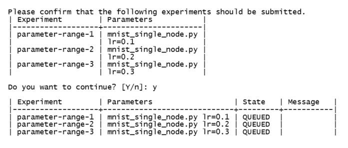

# Submitting Multiple Experiments

This section describes how to launch multiple experiments using the same script.

Storage locations for your input and output folders are determined by the mount command. See [Working with Datasets](working_with_datasets.md) and [Mounting Experiment Input to Storage](mount_exp_input.md).

To submit multiple individual experiments that use the same script, use the following command syntax (the line wrap _is not_ intended).

**Syntax:** `nctl exp submit --parameter_range SCRIPT_NAME [-- SCRIPT_PARAMETERS]`

**Note:** `SCRIPT_NAME` above refers to values (set or of a range) of a single parameter.

An example command is shown below:  

`$ nctl experiment submit --parameter_range lr "{0.1, 0.2, 0.3}" examples/mnist_single_node.py -- --data_dir=/mnt/input/root/public/MNIST`

Refer to [Working with Datasets](working_with_datasets.md) for instructions on uploading the dataset to the `input_shared` folder. Parameters can include either:

* `parameter-range` argument that defines the name of a parameter together with its values expressed as either a range or an explicit set of values, or

* `parameter-sets` argument that specifies a number of distinct combinations of parameter values.

An example of this command using `parameter_range` is shown below (the line wrap _is not_ intended).

`$ nctl experiment submit --name para-range --parameter_range lr "{0.1, 0.2, 0.3}" mnist_single_node.py -- --data_dir=/mnt/input/root/public/MNIST`

The following result displays.
 

**Note:** Your script _must be_ written to process your input data as it is presented, or conversely, your data _must be_ formatted to be processed by your script. No specific data requirements are made by the Nauta software.

