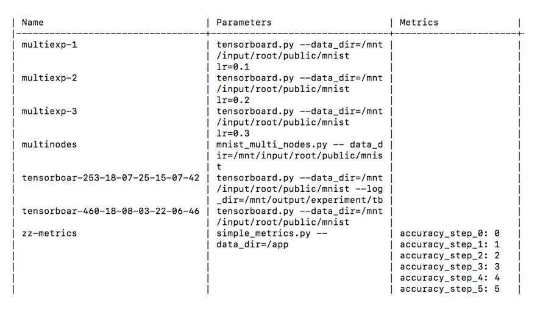
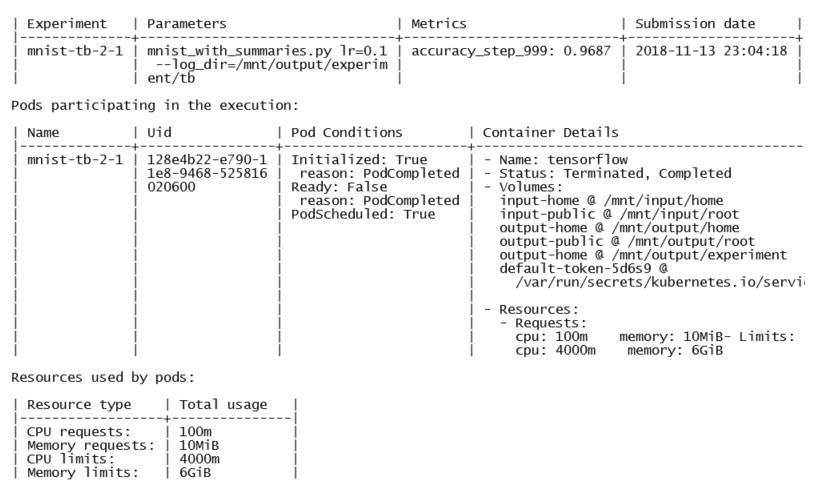

# Evaluating Experiments

## Viewing Experiments Using the CLI

### Viewing all Experiments
To list all experiments you have submitted, run the next command.  The possible returned statuses are QUEUED, RUNNING, COMPLETE, CANCELLED, FAILED, and CREATING.

**Syntax:** `nctl experiment list [options]`

An example experiment list is shown below.  

`$ nctl experiment list`

The following are _example results_ (not all columns are shown).

### Viewing a Single Experiment's Details
The primary purpose of the next command is to provide Kubernetes pod-level information and container information for this experiment. This includes the pod ID, the POD status, information about input and output volumes used in this experiment, and CPU and memory resources requested to perform this experiment.

Use the following command to view a single experiment’s details:

**Syntax:** `nctl experiment view [options] EXPERIMENT_NAME`

An example experiment view is shown below.  

`$ nctl experiment view mnist-tb-2-1`

The following are _example results_ (not all information is show).

#### See also
* [Viewing experiments logs](view_exp_logs.md)
* [Viewing experiments in TensorBoard](view_exp_logs.md)
* [Viewing experiments in Nauta Web UI](view_exp_webui.md)

