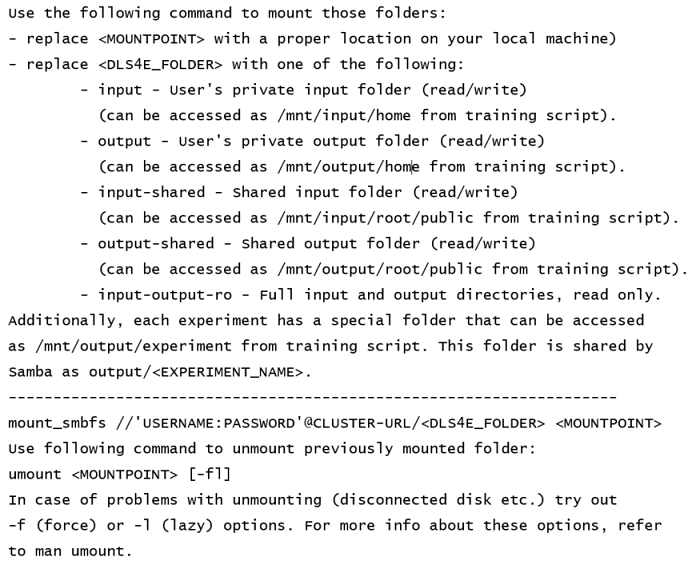

# Working with Datasets

The section discusses the following topics, these are:

 - [Uploading Dataset](#uploading-datasets)  
 - [nctl mount Command](#nctl-mount-command)
 - [Mounting and Accessing Folders](#mounting-and-accessing-folders)
 - [Uploading and Using Shared Dataset Example](#uploading-and-using-shared-dataset-example)

## Uploading Datasets

Nauta offers two ways for users to upload and use datasets for experiments, these are uploading during experiment submission and upload to Nauta storage.

### Uploading During Experiment Submission

Uploading additional datasets or files is an option available for the _submit_ command, using the following option:

`-sfl, --script-folder-location`

Where `script-folder-location` is the name of a folder with additional files used by a script, for example: other .py files, 
datasets, and so on. If the option _is not_ included, the files _will not_ be included in the experiment.

**Syntax:**

`nctl experiment submit --script-folder-location DATASET-PATH SCRIPT_LOCATION`

### Small Datasets 

This option is recommended for small datasets or datasets that _are not_ reused often. In using this option, 
the dataset will be uploaded each time the submit command is executed, which may add to the overall submission time.

**Note:** The `script-folder-location` is also used for script files, not only for datasets.

### Upload to Nauta Storage

Depending on the Nauta configuration, the application uses NFS to connect to a storage location where each user 
has folders that have been setup to store experiment input and output data. This option allows the user to upload 
files and datasets for private use and for sharing. Once uploaded, the files are referenced by the  path.

All data in the folders are retained until the user manually removes it from the NFS storage. Refer to the following 
sections in this chapter for information on how to access and use Nauta storage.

### Large Datasets

This option is recommended for large datasets, data that will be reused often, and data that will be shared among users.

## nctl mount Command

The `mount` command displays another command that can be used to mount Nauta folders to a user’s local 
machine. When a user executes the command, information similar to the following is displayed (this example is for macOS).  Use the following command to mount those folders (all of the following is displayed, although this is an example only).

### Other nctl mount and mount Information

The `nctl mount` command also returns a command to unmount a folder. Nauta uses the mount command that is native to each operating system, so the command printed out _may not_ appear as in this example. In addition, _all variables_ are shown in upper-case.

## Mounting and Accessing Folders

The following table displays the access permissions for each mounting folder.

The following table shows the access permissions for each mounting folder.

| Nauta Folder | Reference Path | User Access | Shared Access
|:--- |:--- |:--- |:--- |
| input |	/mnt/input/home |	read/write	| - |
| output |	/mnt/output/home |	read/write |	- |
| input-shared	| /mnt/input/root/public	| read/write |	read/write |
| output-shared	| /mnt/output/root/public |	read/write |	read/write |
| input-output-ro | | read |	read |

## Uploading and Using Shared Dataset Example

The default configuration is to mount `my-input` and `my-output` folders to Nauta storage. Perform these steps to mount a local folder/machine to Nauta storage and use the files when performing training.

1. Linux/macOS only: Create a folder for mounting named `my-shared-input`:

   `$ mkdir my-shared-input`

2. Use the mount command to display the command that should be used to mount your local folder/machine to your Nauta input folder.

    `$ nctl mount`

3. Enter the mount command that is provided by `nctl mount` using the input-shared as the `NAUTA_FOLDER`and `my-shared-input` folder or `Y:` as the MOUNTPOINT. The following are examples of mounting the local folder to the Nauta output folder for each OS:

   * **MacOS:** `mount_mbfs //'USERNAME:PASSWORD'@CLUSTER-URL/input-shared my-shared-input`
   * **Ubuntu:** `sudo mount.cifs -o username=USERNAME,password=PASSWORD,rw,uid=1000 //CLUSTER-URL/input-shared my-shared-input`
   * **Windows:** Use Y: drive as mount point `net case Y: \\CLUSTER-URL\input-shared /user:USERNAME PASSWORD`

4.	Navigate to the mounted location:
    * **MacOS/Ubuntu only:** Navigate to my-shared-input folder.
    * **Windows:** Open Explorer Window and navigate to Y: drive
  
5.	Copy input data or files to this folder for use when submitting experiments. After copying, the files will be located 
in Nauta storage and can be used by any user for their experiments.

6.	Using the MNIST example from [Submitting an Experiment](getting_started.md#submitting-an-experiment), you can download the MNIST dataset from this link: Mnist Dataset: http://yann.lecun.com/exdb/mnist

7.	Create a MNIST folder in the Nauta input-shared folder.

8.	Copy the downloaded files to the folder.

9.	Submit an experiment referencing the new shared dataset. From the examples folder enter this command:

    `nctl experiment submit --name mnist-shared-input examples/mnist_single_node.py -- --data_dir==/mnt/input/home/mnist`

10.	If you want to copy your data to shared folder use `input-shared` instead of input in step 2. Doing so informs any Nauta that they can use the same path to reference the MNIST dataset on your shared Nauta Storage.

## Uploading and Using a Shared Dataset Example

If you want to copy your data to a shared folder, use input-shared instead of input in step 3.  Using the shared Nauta storage will allow all Nauta users to use the same MNIST dataset by referencing the shared path, `/mnt/input/root/public/MNIST`.

